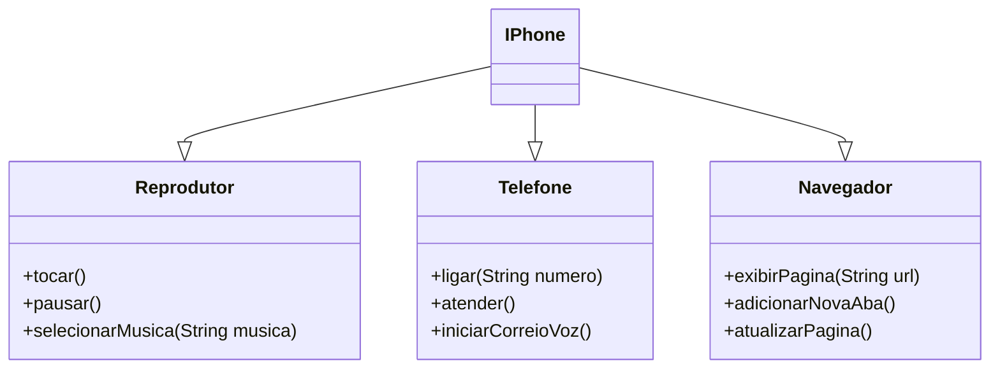

## Diagrama de Clases iPhone UML (Mermaid)

```mermaid
classDiagram
IPhone --|> Reprodutor
IPhone --|> Telefone
IPhone --|> Navegador
Reprodutor : +tocar()
Reprodutor : +pausar()
Reprodutor : +selecionarMusica(String musica)
Telefone : +ligar(String numero)
Telefone : +atender()
Telefone : +iniciarCorreioVoz()
Navegador : +exibirPagina(String url)
Navegador : +adicionarNovaAba()
Navegador : +atualizarPagina()
```
